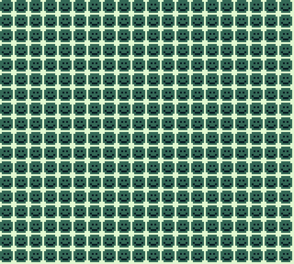

Game Boy example for Skrolli Magazine 2017.2
==========================================

The cart header is contained in [header.z80](header.z80), and [macros.inc](macros.inc) contains some convenience macros. All the relevant executable code is in [main.z80](main.z80).

How to compile and run
----------------------
`run.bat` builds and runs the ROM image (example.bg) on Windows using
[Rednex GameBoy Development System](https://github.com/rednex/rgbds) and [BGB Gameboy Emulator](http://bgb.bircd.org/).
